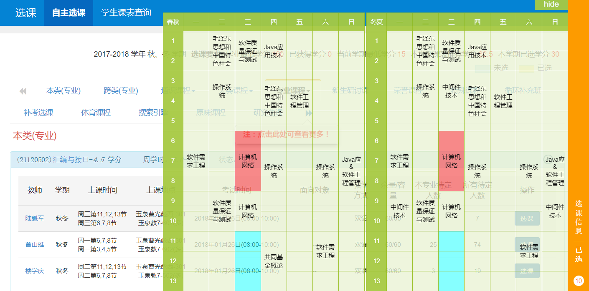

# ZJU新选课系统插件

Chrome插件，展示小课表

### 更新

v1.2.1 修复一个bug，现在table可以穿透鼠标事件了

v1.2.0 全部重构，使用自己的hQuery取代jQuery，转向ES6

v1.1.1 更新css，修复win下字体过小问题

v1.1.0 修复多志愿显示不全问题

### 使用

1. 在github右上角选择 Clone or download，下载解压
2. 打开Chrome，输入chrome://extensions/，或者在菜单里选择 更多工具 -> 扩展程序
3. 勾选 "开发者模式"，选择 "加载已解压的拓展程序"，选中解压的文件夹
4. 登陆新选课系统愉快的选课吧 >. <

### 高亮

当鼠标停在选课系统的某门课上时，会高亮课表上相应的上课时间

蓝色： 待选课程

红色： 冲突课程

### 冲突选课

同一时间有多门不同课程的

两门将以 & 连接共同显示

三门及以上不追加处理

### 其他

为保证对齐课程字数多于12字会截断

未出现在新选课系统侧栏中的课无法显示

隐藏（hide）之后再显示（show）会刷新课表
